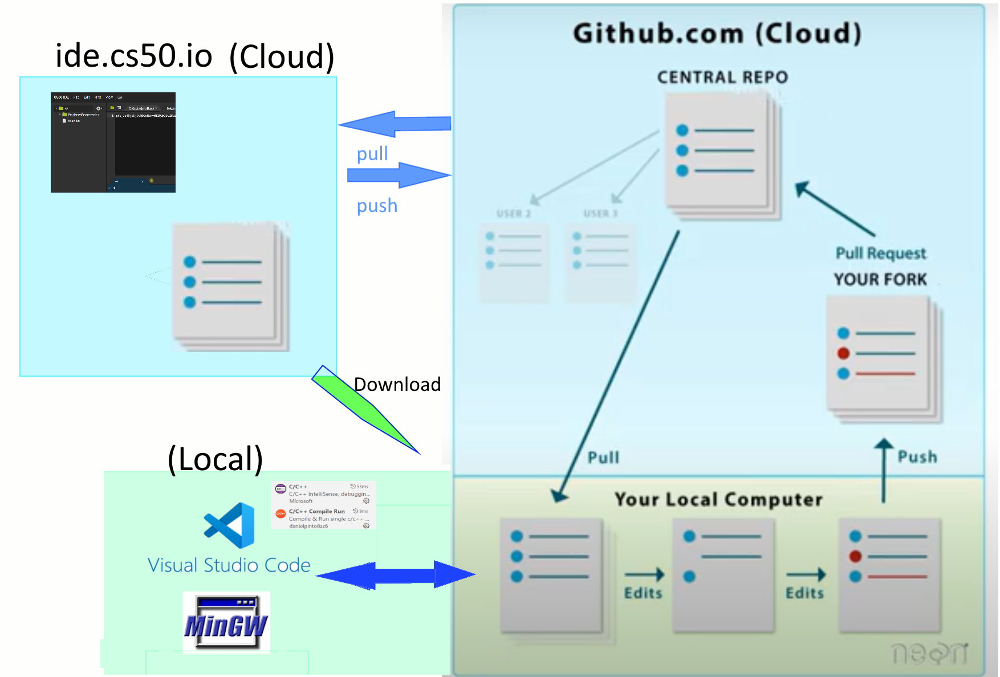

# Configuración del entorno de trabajo

En esta asígnatura se **aprenderá a programar**, pero además trabajaremos de forma cooperativa para desarrollar todos los ejercicios de las prácticas.

Este **trabajo en equipo** se fundamentará en compartir el trabajo realizado a través del uso de repositorios compartidos de código.

La plataforma que se utilizará es **GitHub** que permite alojar proyectos utilizando el sistema de control de versiones Git para la creación de código fuente de programas de ordenador.

Lo primero por tanto será crear una cuenta en www.gihub.com

## Creación de cuentas de github

Crear la cuenta de github utilizando el boton **Sing up** en la esquina superior derecha de la página www.github.com. Se debe utilizar la cuenta institucional de la universidad de Almería (.inlumine.es) para el registro de la cuenta.

En caso de dudas en el proceso se puede consultar los trabajos del proyecto aigora (Universidad Politécnica de Madrid).

## Entornos de desarrollo integrado IDE

## Conectar con el IDE

debemos entrar en

